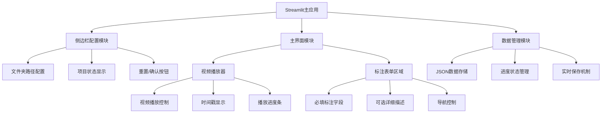

# Streamlit 视频标注应用技术方案

## 🏗️ 应用架构设计



## 📋 核心功能特性
- **46个文件夹管理**：自动扫描和组织视频文件
- **必填标注字段**：autonomous_mode, driving_control_style, visual_attention_style, integrated_style, suggestion
- **可选详细描述**：SceneDescription, Driver'sAttention, Human-MachineInteraction, Evaluation&Suggestions
- **实时保存**：每个字段修改后自动保存到JSON文件
- **断点续标**：支持暂停后继续标注
- **进度跟踪**：显示每个文件夹和整体完成状态
- **词组库集成**：从词组库文件加载选项，支持1-3个选择

## 🎯 技术实现
- **框架**：Streamlit + Python
- **视频播放**：st.video组件，支持播放控制和时间戳
- **数据存储**：JSON格式，结构化保存标注数据
- **状态管理**：st.session_state管理应用状态
- **界面布局**：左侧配置栏 + 右侧视频播放和标注区域

## 📁 项目结构
```
videoLabel/
├── app.py                 # 主应用入口
├── modules/
│   ├── file_manager.py   # 文件管理
│   ├── video_player.py   # 视频播放
│   ├── annotation_form.py # 标注表单
│   ├── data_storage.py   # 数据存储
│   └── progress_manager.py # 进度管理
├── config/
│   └── word_bank.py      # 词组库配置
├── data/
│   └── annotations/      # JSON标注数据
└── requirements.txt